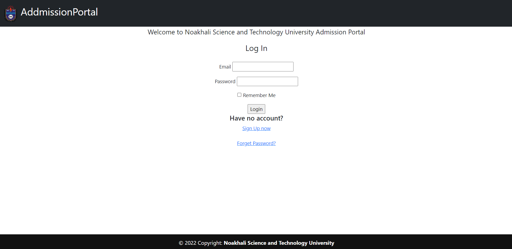
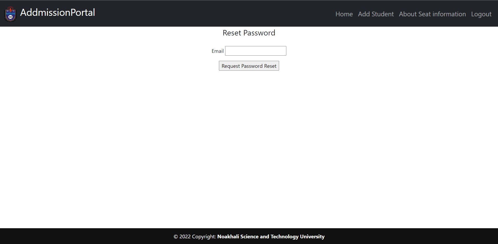

# Admission Process Tracking using Flask Micro Web Framework

In this project I am going to build a admission process in a simple way using flask framework.
Check the live project here http://shuvosaharoy.pythonanywhere.com/

Use abc@gmail.com as email and abc as password to login in.

## Licenses

## <strong>Tech Stack</strong>

* Python, Flask

## <strong>Demo</strong>

## Features

Any additional information goes here

1. Creating user account,
2. Password reset using mail,
3. Add, update, delete features for student account,
4. For every student this is a student profile,
5. Always security check,
6. Sqlite database,
7. SqlAlchemy
8. Query on database and check database before any commit.

## Environment Variables

To run this project, you will need to add the following environment variables to your environment Variables

`email`
`password`

## Some Screenshot

# Limitation
As I make it for learning purpose
1. There is no admin login.
2. Any registered user can play with database.
